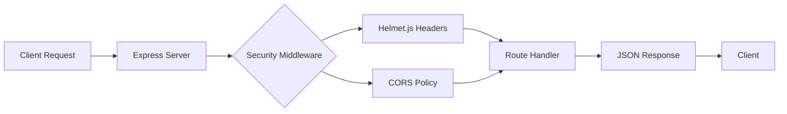

<div align="center">

# Security Check API | API de Verificação de Segurança

[](https://nodejs.org/)
[](https://expressjs.com/)
[](Dockerfile)
[](LICENSE)

**Lightweight Express.js API server with security middleware for application health monitoring**

[English](#english) | [Português](#português)

</div>

---

## English

### Overview

A Node.js/Express application implementing a security-focused API server with health check endpoints. The project demonstrates best practices in API security, including Helmet.js middleware integration, environment-based configuration, and container-ready deployment with Vercel and Cloud Foundry support.

### Architecture



### Key Features

- **Express.js API**: Lightweight REST API with JSON responses
- **Security Middleware**: Helmet.js integration for HTTP security headers
- **Environment Config**: Port configuration via environment variables
- **Multi-Platform Deploy**: Vercel, Cloud Foundry (manifest.yml), and Docker support
- **Health Check Endpoint**: Root endpoint for monitoring and load balancer probes

### Tech Stack

| Technology | Purpose |
|-----------|---------|
| Node.js 18+ | Runtime environment |
| Express 4.x | Web framework |
| Helmet.js | Security headers middleware |
| Docker | Containerization |
| Vercel | Serverless deployment |

### Quick Start

```bash
# With Docker
docker build -t security-check .
docker run -p 8090:8090 security-check

# Local
npm install
node server/index.js

# Environment
cp .env.example .env
```

### API Endpoints

| Method | Endpoint | Description |
|--------|----------|-------------|
| GET | `/` | Health check - returns "Hello, World!" |

### Industry Applications

- **DevSecOps**: API security template for microservices architectures
- **Cloud Native**: Container-ready service with multi-platform deployment support
- **Compliance**: HTTP security headers baseline for OWASP Top 10 mitigation
- **Monitoring**: Health check patterns for Kubernetes liveness/readiness probes

### Project Structure

```
├── server/
│   └── index.js              # Express server with security middleware
├── public/                    # Static assets
├── .env.example               # Environment configuration template
├── Dockerfile                 # Container configuration
├── manifest.yml               # Cloud Foundry deployment
├── vercel.json                # Vercel deployment config
├── package.json               # Dependencies
└── README.md
```

---

## Português

### Visão Geral

Aplicação Node.js/Express implementando um servidor API focado em segurança com endpoints de health check. O projeto demonstra boas práticas em segurança de API, incluindo integração de middleware Helmet.js, configuração baseada em ambiente e deployment container-ready com suporte a Vercel e Cloud Foundry.

### Funcionalidades Principais

- **API Express.js**: API REST leve com respostas JSON
- **Middleware de Segurança**: Integração Helmet.js para headers HTTP seguros
- **Configuração por Ambiente**: Porta configurável via variáveis de ambiente
- **Deploy Multi-Plataforma**: Suporte a Vercel, Cloud Foundry e Docker
- **Health Check**: Endpoint raiz para monitoramento e probes de load balancer

### Aplicações na Indústria

- **DevSecOps**: Template de segurança para arquiteturas de microsserviços
- **Cloud Native**: Serviço container-ready com suporte multi-plataforma
- **Compliance**: Baseline de headers de segurança HTTP para mitigação OWASP Top 10
- **Monitoramento**: Padrões de health check para probes Kubernetes

### Como Executar

```bash
# Com Docker
docker build -t security-check .
docker run -p 8090:8090 security-check

# Local
npm install
node server/index.js
```

---

## License

This project is licensed under the Apache License 2.0 - see the [LICENSE](LICENSE) file for details.
